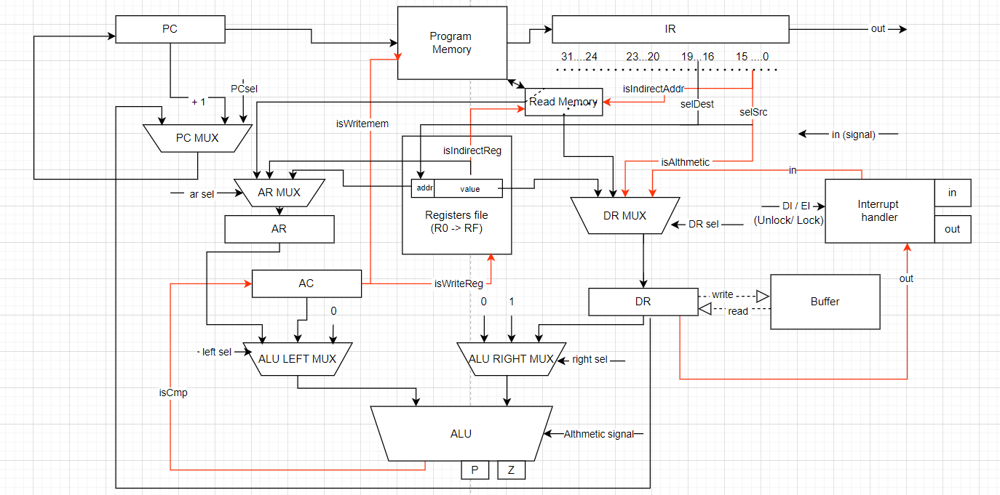
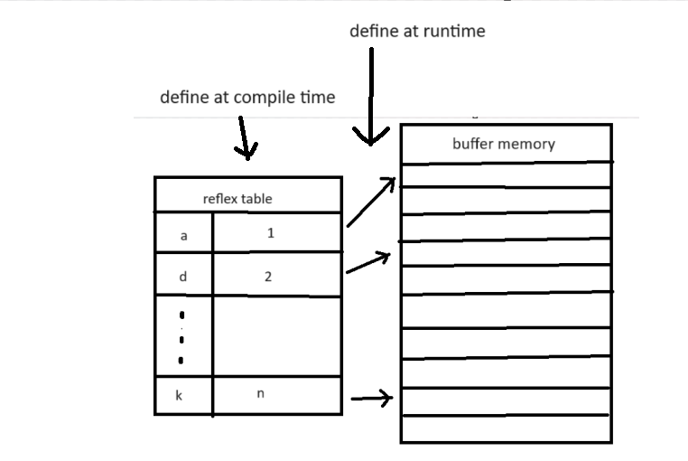
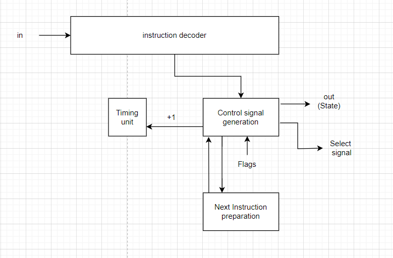

# Отчёт по лабораторной работе № 3

Дау Конг Туан Ань: P33151

**Вариант**
```lisp | cisc | neum | hw | instr | binary | stream | port | pstr | prob2 | [4]char```

Без усложнения

## Язык программирования

Язык lisp-подобный.

`expression` — это две пары круглых скобок и все, что внутри них. 
Это единственный объект, который может содержать произвольное количество дочерних 
узлов и предназначен для инкапсуляции абстрактных узлов (например, программу можно 
рассматривать как большое выражение, содержащее выражения меньшего размера (которые
 являются конкретными инструкциями)). В зависимости от того, где оно используется, 
 оно имеет разные значения. Например, при использовании во второй позиции defun это контейнер 
 для параметров, но если он стоит на третьей позиции, это будет исполняемое выражение.

Типизация динамическая, поддерживаются два типа: целые числа и строки. 

Для `while` и `if` можно использовать целые числа, где `0` - это `false`, а любое другое число - `true`.

```bnf
    <!-- only expression can hold undefined multi node, and they an be anything -->
    <expression> ::= "(" <literal> | <identifier> | <expression>* ")" 
    <integer-literal> ::= [0-9]+
    <string-literal> ::= "\"" [a-zA-Z]+ "\""
    <EOL> ::= "/"
    <identifier > ::= [a-zA-Z]+
    <literal> ::= <integer-literal> | <string-literal> | <boolean-literal>
    <data> ::= <literal> | <identifier > | <expression>
    <defun-expression> ::= "(" "defun" <identifier> <expression> <expression> ")"
    <func-call-expression> ::= "(" call <identifier> <expression> ")"
    <return> ::= return <data>
    <from-expression> ::= from <literal>
    <to-expression> ::= "to" <literal>
    <for-expression> ::= "for" <identifier> <from-expression> <to-expression>
    <loop-expression> ::= "(" "loop"  <for-expression> <expression> ")" 
    <while-expresison> ::= while <expression> <expression>
    <set-expression> ::= "(" "set" <identifier> <literal>|<expressions> ")"
    <if-expression> ::= "(" "if" <condition_expression> <true_expression> | <true_expression> <false_expression> ")"
    <print-expression> ::= "(" "format"  <data> ")"
    <logical-operator> ::= "<" | "=" | ">" | "<=" | ">=" | "\=" | "|" | "&" | "~"
    <logical-expression> ::= <logical-operator> <data> <data>
    <mathematic-operator> ::= "+" | "-" | "*" | "/" | "mod"
    <mathematic-expression> ::= <mathematic-operator> <expresision>
```

* `defun` - поддерживать рекурсию, используя регистры в качестве места для хранения параметров, 
так что до сих пор он поддерживал максимум 2 параметра. На самом деле я могу управлять 
ими по 3 или 4 параметрам, но это не имеет значения. Я также думаю о сохранении их в стеке, 
но я не знаю, как их использовать в ситуации рекурсии, поэтому у меня есть рекурсия и 2 функции-параметра.
* `if` - поддерживать как if then, так и if then else, не объявляя их сначала
* `while` - unstatement-loop, выполнять цикл до тех пор, пока условие не станет ложным, ничего не возвращать
* `let` - сопоставить идентификатор с адресом литерала/идентификатора/выражения, первый параметр должен быть идентификатором
* `set` - если второй атрибут является выражением, выполните выражение, затем переместите значение возвращаемого значения в 
первый идентификатор, иначе просто переместите значение второго атрибута в первый атрибут.
* `input` - выполнить событие прерывания, сохранить значение в буфер, все значения рассматриваются как символы
* `format` - выполнить событие прерывания, отправить данные на выходной порт, может обрабатывать как числовые, 
так и строковые ситуации. это означает, что при печати номера система может распознать и распечатать его как строку
* `return` - установить значение rax
* `call` - выполнить функцию (и только функцию)
* литералы - возвращают сами себя.
* идентификаторы - возвращают значение переменной, к которой они привязаны.
Использование идентификатора функции без ее вызова недопустимо.

## Организация памяти 

Фон Неймановская архитектура.

Память представляет из себя четыре секции:

```text
    +-----------------+
    |   CODE_ADDRESS  |
    +-----------------+
    |   STATIC_DATA   |
    |                 |
    |                 |
    |                 |
    +-----------------+
    |                 |
    |     FUNCTION    |
    |                 |
    +-----------------+
    |      CODE       |
    |                 |
    |                 |
    |                 |
    +-----------------+
    |      STACK      |
    |                 |
    |                 |
    +-----------------+
```

* `CODE_ADDRESS` - первая ячейка памяти: адрес инструкции программы, известный как первое значение регистра «pc».

* `STATIC_DATA` - статические данные — все, что объявлено в коде как буквальное. здесь НЕ хранятся входные данные, а только литеральные данные в коде.
    Строка: первая ячейка будет хранить длину строки до тех пор, пока уведомит, что это будет строка (первый бит равен 1), следующая ячейка - это код символа ASCII. 
    Итак, первый бит числа равен 0 (максимальное значение равно 2 ^ 31 - 1).
* `FUNCTION`: функция сначала будет храниться здесь, и функция из другого файла, если `#include` также сохраняется здесь.

* `CODE` - секция, в которой хранятся инструкции.

* `STACK` для сохранения временных данных во время выполнения. Проблема в том, что мы не
 можем фактически управлять ими во время компиляции, поэтому необходимо использовать его в ограниченном объеме, 
 с `PUSH`, `POP` и `rsp`
## Система регистрации
#### Специальные регистры
Это `PC`, `AR`, `IR`, `DR` и `AC`. Машинный код не имеет права работать с этими регистрами.
* `PC` ПК определяет текущий адрес инструкции
* `AR` использовать в качестве адреса памяти/регистров, которые будут загружаться/сохраняться. 
Он также может видеть левое значение в арифметической инструкции.
* `IR` зарегистрировать команду удержания, которая подготовлена к отправке в блок управления
* `DR` Регистр данных — делайте как обычный регистр данных, особенно все входные/выходные 
данные будут проходить через этот регистр перед переходом к следующему пункту назначения.
* `AC` после выполнения `ALU` результат будет сохранен здесь
#### Общие регистры
Это `rax`, `rdx`, `rcx`, `rbx` , `rsp`, `sbp`, `rsi`, `rdi` и `rio`
машинный код будет работать с этими регистрами. несмотря на то, что теоретически они могут работать без определенных ролей, 
но все они имеют личное назначение, например, 
* `rsi` и `rdi` — это 2 регистра для сохранения параметров функции
* `rio` сохраняет данные перед отправкой на внешний порт/после получения из порта
* `rsp` — стек указатель
* `rdx` рассматривается как временный регистр для сохранения данных
* `rcx` — счетчик цикла
* `rax` — сохранение результата althmetic operation

## Система команд

* Машинное слово - 32 бита, знаковое.
* Инструкции делятся на 4 типа: инструкции из 0 элементов, инструкции из 1 элемента, инструкции из 2 элементов 
и математические инструкции. Причина, по которой математические инструкции относятся к отдельной категории, 
заключается в том, что их длина может достигать двух машинных слов, в зависимости от объявленного ими режима адресации.

* Ввод-вывод осущетсвляется как поток токенов, port-mapped.
* Поток управления:
  * Поддерживаются условные и безусловные переходы.
  * В случае, если инструкция не касается переходов, то после нее инкрементится PC (Program counter).

##### Поддерживаются 4 вида адресации:
* Прямой регистр - работа напрямую с этим регистром
* Косвенный регистр - работа со значением памяти, адрес которого хранится в этом регистре.
* Адрес
* Ценить

На самом деле у него также есть еще один режим-буфер, но он работает только с одной инструкцией `RB` для чтения буфера.

в двухэлементной инструкции первый элемент всегда регистрирует адрес (прямой/косвенный), 
поэтому у нас нет `MOV <to-address> <from-address>`, второй элемент свободен в выборе

Количество циклов выполнения зависит от кода операции и режима, от 1 до 3.

### Набор инструкций
* Инструкция 0-типа: [`RET`, `NOP`, `HALT`, `DI`, `EI`, `IN`, `OUT`, `STR`]
* Инструкция 1-типа: [`JMP`, `CALL`, `BGT`, `BEQ`, `PUSH`, `POP`, `INC`, `NOT`, `RB`]
* Инструкция 2-типа: [`LOAD`, `STORE`, `CMP`, `MOV`, `LSL`, `LSR`]
* Инструкция Арифметического типа: [ `ADD`, `SUB`, `MUL`, `DIV`, `MOD`, `AND`, `OR`]

|Инструкция|Длина (машинные слова)|Количество тиков|Код|Примечание|
|----------|---------|--------|--------|-------------------------------|
|`RET`|1|1|`0x1`|`PC <- #0x3`|
|`NOP`|1|1|`0x0`|`PC <- PC + 1`|
|`HALT`|1|1|`0x1F`|`END_SIGNAL`|
|`DI`|1|2|`0x19`|`DI_SIGNAL`, `PC <- PC + 1`|
|`EI`|1|2|`0x1A`|`EI_SIGNAL`, `PC <- PC + 1`|
|`IN`|1|1| `0x6`|  `RIO <- IN `, `PC <- PC + 1`|
|`OUT`|1|1|`0x7`| `RIO -> OUT `, `PC <- PC + 1`|
|`STR`|1|2|`0x1D`| `PRINT_STR_SIGNAL`, `PC <- PC + 1`|
|`JMP`|1|1|`0x2`|`PC <- ADDR`|
|`CALL`|1|2| `0x3`|`#0x3 <- PC`,  `PC <- ADDR`|
|`BGT`|1|1|`0x5`|`P == 1 ? PC <- ADDR : PC <- PC + 1`|
|`BEQ`|1|1|`0x4`|`Z == 1 ? PC <- ADDR : PC <- PC + 1`|
|`PUSH`|1|3|`0x8`| `[rsp] <- value ` , `rsp <- rsp - 1`, `PC <- PC +1`|
|`POP`|1|3|`0x9`|`[rsp] -> addr`, `rsp <- rsp + 1`, `PC <- PC +1`|
|`INC`|1|2|`0x1B`|`reg <- [reg] + 1`, `PC <- PC +1`|
|`NOT`|1|2|`0x18`| `reg <- ~[reg]`, `PC <- PC +1`|
|`RB`|1|2|`0x1C`|`DR <- buffer`, `PC <- PC +1`|
|`LOAD`|1|1|`0xA`|`reg <- [addr]`,  `PC <- PC +1`|
|`STORE`|1|1|`0xB`| `addr <- [reg]`, `PC <- PC +1`|
|`CMP`|1|1|`0x16`| `SET FLAG : ALU.left - ALU.right`, `PC <- PC +1`|
|`MOV`|1|1|`0x17`|`[reg_dest] <- [reg_src]`|
|`LSL`|1|2|`0x13`|`reg <- [reg] << value `, `PC <- PC +1`|
|`LSR`|1|2|`0x13`|`reg <- [reg] >> value `, `PC <- PC +1`|
|`Arithmetic` |1-2 | 3|`0xC - 0x12 `| `rax <- ALU.left <operator> ALU.right`,`PC <- PC +1`|  


## Траслятор
Транслятор состоит из двух частей:
* Лексер, реализован в [Lexer](./lab3/Compiler/Lexer.py)
* AST-builder: строит абстрактное синтаксическое дерево, функция возвращает корень дерева, реализован в [AST](./lab3/Compiler/Parser.py)
* Модуль, преобразующий токены в программу, реализован в [Translator](./lab3/Compiler/Generator.py)

#### Как работает переводчик?
##### Стратегия: Посетитель
* Шаг 1: просканируйте все литералы, сохраните их в памяти, запомните начальный адрес каждого литерала
* Шаг 2: Функции сканирования и перевода. Здесь функции могут работать независимо, без какой-либо связи с другими частями. Программа пока не поддерживает библиотеки, но по сути она также импортирует функции из других файлов, компилирует и сохраняет сюда (если это делается) - большой разницы нет.
* Шаг 3: Создайте справочную таблицу для входного буфера. Например, если у нас есть команда `input t`, то t будет ссылаться на фиктивное значение в буфере, из которого мы можем обратиться к реальному адресу данных в буфере (см. буфер).
* Шаг 4: Сканируйте оставшиеся узлы по порядку.

На вход принимает два файла:
* Файл с программой на языке высокого уровня.
* Путь к файлу, в который будет записана программа в машинных словах (в виде binary)


### DataPath



Реализован в классе `DataPath`
##### Примечание :
* Красный путь: действие по передаче данных выполняется только тогда, когда сигналы выше него отправляются обратно CU.
* Черный путь: данные передаются без условий.
* Сломанный путь: неортодоксальное действие по передаче данных — данные второго сорта.
##### Элементы:
* `is_*` - Сигнал разрешения пути передачи данных, управляемый CU
* `* sel` and `* signal` - Сигнал выбора данных на MUX/ Althmetic selection
* `sel*` - Данные после прохождения декодера (не сигнал/выбор, а данные инструкции). Почему он должен быть в пути к данным: в некоторых случаях нам нужно добавить/изменить данные, чтобы они соответствовали инструкции (`PUSH: rsp <- rsp -1`, в команде у нас нет rsp, но нам все равно нужно выполнить их)
* `* MUX` - Multiplexer 
* `Z` - Флаг zero
* `P` - положительный флаг - потому что в операторе есть только BGT. В общем, это просто имя
* `ALU` - Arithmetic Logic Unit
* `Read Memory` - это не сущность, а просто представляет собой чтение данных из основной памяти, я отделил их, чтобы схема была понятнее
##### Подсистемы
* `InterruptHandler` - Форма блокировки предотвращает несанкционированный доступ к портам/путям передачи данных.
* `in`/ `out` block : Порты ввода/вывода
* `Registers file` - Где расположены общие регистры - и не только это: Содержит функцию синхронизации (синхронизация данных из addr - в некоторых случаях addr - это не адрес регистра, а данные, поэтому не проверяем синхронизацию набора значений = RF[addr ] вызовет ошибку доступа, что позволит гибко манипулировать режимами адресации без манипуляций с фактическими регистрами в файле регистров)

### Buffer 
*Здесь мы упоминаем только входной буфер, у системы нет выходного буфера, потому что, если выходной буфер просто означает сохранение данных до завершения программы, а затем их распечатку, то `out.txt` сам выполняет эту работу.*

Реализован в классе `Buffer`:


##### Почему буферизация должна быть реализована таким образом?
* Поддерживает несколько входов
* Нет необходимости записывать данные в `Main_Memory`
В случае использования:
```
input a 
input b
format a
format b
```
Очевидно, что в этом случае, если делать это обычным способом, сохранение данных `a` в `memory` неизбежно, но мой вариант - ввод-вывод с отображением портов, поэтому запись данных, поступающих в память, потеряет смысл самого этого метода.

##### Как это работает?
Как упоминалось выше, для управления несколькими входными данными без записи в память:
* Во время компиляции сканируйте все операторы `input`, помещайте их в `reflex table`, здесь им выделяется только фиктивный адрес, этот адрес не указывает на ячейку памяти, какую-либо официальную информацию.
* Во время выполнения данные будут вводиться в виде токенов, при первом вводе стартовый адрес явно `0x0`, при получении `EOL` новая программа начинает указывать 2 в `reflex_table` на актуальный адрес - адрес следующего свободная ячейка памяти сразу после данных первого входа.

Чтобы было легче представить, предположим, что у нас есть:
```
input t
input f
input k
```
Входные данные:
```
Фаза 1: 'hello\n'
Фаза 2: 'world\n'
Фаза 3: 'me\n'
```


|Identifier | Начало (compile time)| Фаза 1 (runtime) | Фаза 2 (runtime) |
|-----------|----------------------|------------------|------------------|
|    t      |   0                  |       0          |         0        |
|    f      |   0                  |       6          |         6        |     
|    k      |   0                  |       0          |         12       |


### ControlUnit
Реализован в классе `ControlUnit`



Основная работа с данными происходит на уровне DataPath, а ControlUnit с помощью
сигналов работает с этими данными. ControlUnit реализован как hardwired.
#### Ингредиент:
* `Instruction decoder`: Устройство получает данные от «IR», разлагает их на данные инструкций, готовясь к генерации сигнала.
* `Control signal generation` : Создайте сигнал, значение селектора для возврата в путь к данным.
* `Next Instruction Preparation` : Отвечает за сохранение состояния основной инструкции в инструкции, количество машинных слов которой больше 1 (арифметическая инструкция).
* `Timing unit` : блок для подсчета количества выполненных тиков
 ##### Как обрабатывать инструкции длиной в 2 машинных слова
 Рассмотрим уникальную ситуацию, когда возникает инструкция длиной 2 машинных слова:
```[ADD | FIRST_PARAM(value 16-bit)][SECOND _PARAM(value 32 -bit)]```
* **Первая инструкция**: CU декодирует данные о первом параметре, записывает их в ALU.left, затем сохраняет информацию о типе оператора в NIP (подготовка следующей инструкции), включает флаг `in_progress`, чтобы указать на завершение этой инструкции.
* **Вторая инструкция**: CU проверяет флаг in_progress, передает все инструкции в DR, выполняет ALU, выключает флаг in_progress.

*Это не типичный случай архитектуры CISC с инструкциями переменной длины, но я делаю это как демонстрацию обработки инструкций переменной длины, что является ее особенностью. Благодаря этой идее мы можем полностью создавать инструкции длиной более 1 машинного слова.*

## Тестирование

Для CI использовался пайплайн из примера, но модифицированный под гитхаб:
```yaml
name: CI

on:
  push:
    branches: [ "master" ]
  pull_request:
    branches: [ "master" ]

permissions:
  contents: read


jobs:
  build:

    runs-on: ubuntu-latest

    steps:
    - name: Checkout code
      uses: actions/checkout@v2

    - name: Set up Python
      uses: actions/setup-python@v3
      with:
        python-version: 3.12

    - name: Install dependencies
      run: |
        python -m pip install --upgrade pip
        pip install pytest-golden
        python -m pip install coverage
        python3 -m pip install mypy
        pip install ruff
        pip install poetry
        poetry install

    - name: Run tests and coverage
      run: |
        poetry run pytest . -v --update-goldens
        poetry run coverage run -m pytest
        poetry run coverage report
    - name: Run Ruff linters
      run: poetry run ruff check .

```


Также реализованы golden тесты согласно примеру :
* [hello](./golden/testcase-1.yml)
* [cat](./testcase-2.yml)
* [hello_user_name](./golden/testcase-3.yml)
* [prob2](./golden/testcase-4.yml)


### Подробный разбор одной из программ
Возьмем программу (hello_user):

```
  (
    (format "What is your name?/")
    (input x)
    (format "Hello, ")
    (format x) 
  )
```

После трансляции она будет выглядеть вот так( в двоичном файле есть только шестнадцатеричный код. Но я предполагаю, что если мы пишем шестнадцатеричный код в отчете, мы ничего не пишем):
```
  0x0 0x1d NOP
  0x1 0x80000013 - string length
  0x2 0x57 NOP
  0x3 0x68 NOP
  0x4 0x61 NOP
  0x5 0x74 NOP
  0x6 0x20 NOP
  0x7 0x69 NOP
  0x8 0x73 NOP
  0x9 0x20 NOP
  0xa 0x79 NOP
  0xb 0x6f NOP
  0xc 0x75 NOP
  0xd 0x72 NOP
  0xe 0x20 NOP
  0xf 0x6e NOP
  0x10 0x61 NOP
  0x11 0x6d NOP
  0x12 0x65 NOP
  0x13 0x3f NOP
  0x14 0x2f NOP
  0x15 0x80000007 - string length
  0x16 0x48 NOP
  0x17 0x65 NOP
  0x18 0x6c NOP
  0x19 0x6c NOP
  0x1a 0x6f NOP
  0x1b 0x2c NOP
  0x1c 0x20 NOP
  0x1d 0x19000000 DI
  0x1e 0x1d000000 STR
  0x1f 0x8000001 PUSH #0x1
  0x20 0x17310002 MOV #0x1 0x2
  0x21 0x16310015 CMP #0x1 0x15
  0x22 0x4300027 BEQ 0x27
  0x23 0x17180001 MOV #0x8 [ #0x1 ]
  0x24 0x7000000 OUT
  0x25 0x1b000001 INC #0x1
  0x26 0x2300021 JMP 0x21
  0x27 0x9000001 POP #0x1
  0x28 0x1a000000 EI
  0x29 0x19000000 DI
  0x2a 0x6000000 IN
  0x2b 0x1638000d CMP #0x8 0xd
  0x2c 0x430002e BEQ 0x2e
  0x2d 0x230002a JMP 0x2a
  0x2e 0x1a000000 EI
  0x2f 0x19000000 DI
  0x30 0x1d000000 STR
  0x31 0x8000001 PUSH #0x1
  0x32 0x17310016 MOV #0x1 0x16
  0x33 0x1631001d CMP #0x1 0x1d
  0x34 0x4300039 BEQ 0x39
  0x35 0x17180001 MOV #0x8 [ #0x1 ]
  0x36 0x7000000 OUT
  0x37 0x1b000001 INC #0x1
  0x38 0x2300033 JMP 0x33
  0x39 0x9000001 POP #0x1
  0x3a 0x1a000000 EI
  0x3b 0x19000000 DI
  0x3c 0x1c100000 RB buff 0x0
  0x3d 0x1638000d CMP #0x8 0xd
  0x3e 0x4300041 BEQ 0x41
  0x3f 0x7000000 OUT
  0x40 0x230003c JMP 0x3c
  0x41 0x1a000000 EI
  0x42 0x1f000000 HALT
```
Здесь мы вызываем действие прерывания через `DI` и `EI`, мы получаем данные до тех пор, пока вход = `EOL`. Поскольку ввод-вывод с отображением на порту, мы не сохраняем данные со входа в основную память, поэтому для этого нам нужна специальная инструкция — `RB`. Он также отлично справляется с задачей, если у нас есть несколько входных данных, мы можем работать с ними, не перемещая их в основную память.

Лог модели процессора (его начало) выглядит вот так:
```text
  DEBUG    root:Datapath.py:84  tick:     1, AC:        0, AR:        0, DR:        0, PC:     0x1d, rax:        0, rcx:        0, rdx:        0, rbx:        0, rsp:     4000, sbp:        0, rsi:        0, rdi:        0, rio:        0,  interrupt: IOState.Unlock, buffer:        0, p : False, z: False
  DEBUG    root:Datapath.py:84  tick:     2, AC:        0, AR:        0, DR:        0, PC:     0x1e, rax:        0, rcx:        0, rdx:        0, rbx:        0, rsp:     4000, sbp:        0, rsi:        0, rdi:        0, rio:        0,  interrupt: IOState.Unlock, buffer:        0, p : False, z: False
  DEBUG    root:Datapath.py:84  tick:     5, AC:     3999, AR:        4, DR:        0, PC:     0x1f, rax:        0, rcx:        0, rdx:        0, rbx:        0, rsp:     3999, sbp:        0, rsi:        0, rdi:        0, rio:        0,  interrupt: IOState.Unlock, buffer:        0, p :  True, z: False
  DEBUG    root:Datapath.py:84  tick:     6, AC:        2, AR:        1, DR:        2, PC:     0x20, rax:        0, rcx:        2, rdx:        0, rbx:        0, rsp:     3999, sbp:        0, rsi:        0, rdi:        0, rio:        0,  interrupt: IOState.Unlock, buffer:        0, p :  True, z: False
  DEBUG    root:Datapath.py:84  tick:     7, AC:      -19, AR:        2, DR:       21, PC:     0x21, rax:        0, rcx:        2, rdx:        0, rbx:        0, rsp:     3999, sbp:        0, rsi:        0, rdi:        0, rio:        0,  interrupt: IOState.Unlock, buffer:        0, p : False, z: False
  DEBUG    root:Datapath.py:84  tick:     8, AC:      -19, AR:        2, DR:       21, PC:     0x22, rax:        0, rcx:        2, rdx:        0, rbx:        0, rsp:     3999, sbp:        0, rsi:        0, rdi:        0, rio:        0,  interrupt: IOState.Unlock, buffer:        0, p : False, z: False
  DEBUG    root:Datapath.py:84  tick:     9, AC:       87, AR:        8, DR:       87, PC:     0x23, rax:        0, rcx:        2, rdx:        0, rbx:        0, rsp:     3999, sbp:        0, rsi:        0, rdi:        0, rio:       87,  interrupt: IOState.Unlock, buffer:        0, p :  True, z: False
  DEBUG    root:Components.py:244 Out: W
  DEBUG    root:Datapath.py:84  tick:    10, AC:       87, AR:        8, DR:       87, PC:     0x24, rax:        0, rcx:        2, rdx:        0, rbx:        0, rsp:     3999, sbp:        0, rsi:        0, rdi:        0, rio:       87,  interrupt: IOState.Unlock, buffer:        0, p :  True, z: False
  DEBUG    root:Datapath.py:84  tick:    12, AC:        3, AR:        1, DR:       87, PC:     0x25, rax:        3, rcx:        3, rdx:        0, rbx:        0, rsp:     3999, sbp:        0, rsi:        0, rdi:        0, rio:       87,  interrupt: IOState.Unlock, buffer:        0, p :  True, z: False
  DEBUG    root:Datapath.py:84  tick:    13, AC:        3, AR:        1, DR:       33, PC:     0x20, rax:        3, rcx:        3, rdx:        0, rbx:        0, rsp:     3999, sbp:        0, rsi:        0, rdi:        0, rio:       87,  interrupt: IOState.Unlock, buffer:        0, p :  True, z: False
  DEBUG    root:Datapath.py:84  tick:    14, AC:      -18, AR:        3, DR:       21, PC:     0x21, rax:        3, rcx:        3, rdx:        0, rbx:        0, rsp:     3999, sbp:        0, rsi:        0, rdi:        0, rio:       87,  interrupt: IOState.Unlock, buffer:        0, p : False, z: False
  DEBUG    root:Datapath.py:84  tick:    15, AC:      -18, AR:        3, DR:       21, PC:     0x22, rax:        3, rcx:        3, rdx:        0, rbx:        0, rsp:     3999, sbp:        0, rsi:        0, rdi:        0, rio:       87,  interrupt: IOState.Unlock, buffer:        0, p : False, z: False
  DEBUG    root:Datapath.py:84  tick:    16, AC:      104, AR:        8, DR:      104, PC:     0x23, rax:        3, rcx:        3, rdx:        0, rbx:        0, rsp:     3999, sbp:        0, rsi:        0, rdi:        0, rio:      104,  interrupt: IOState.Unlock, buffer:        0, p :  True, z: False
  DEBUG    root:Components.py:244 Out: h
  DEBUG    root:Datapath.py:84  tick:    17, AC:      104, AR:        8, DR:      104, PC:     0x24, rax:        3, rcx:        3, rdx:        0, rbx:        0, rsp:     3999, sbp:        0, rsi:        0, rdi:        0, rio:      104,  interrupt: IOState.Unlock, buffer:        0, p :  True, z: False
  DEBUG    root:Datapath.py:84  tick:    19, AC:        4, AR:        1, DR:      104, PC:     0x25, rax:        4, rcx:        4, rdx:        0, rbx:        0, rsp:     3999, sbp:        0, rsi:        0, rdi:        0, rio:      104,  interrupt: IOState.Unlock, buffer:        0, p :  True, z: False
  DEBUG    root:Datapath.py:84  tick:    20, AC:        4, AR:        1, DR:       33, PC:     0x20, rax:        4, rcx:        4, rdx:        0, rbx:        0, rsp:     3999, sbp:        0, rsi:        0, rdi:        0, rio:      104,  interrupt: IOState.Unlock, buffer:        0, p :  True, z: False
  DEBUG    root:Datapath.py:84  tick:    21, AC:      -17, AR:        4, DR:       21, PC:     0x21, rax:        4, rcx:        4, rdx:        0, rbx:        0, rsp:     3999, sbp:        0, rsi:        0, rdi:        0, rio:      104,  interrupt: IOState.Unlock, buffer:        0, p : False, z: False
  DEBUG    root:Datapath.py:84  tick:    22, AC:      -17, AR:        4, DR:       21, PC:     0x22, rax:        4, rcx:        4, rdx:        0, rbx:        0, rsp:     3999, sbp:        0, rsi:        0, rdi:        0, rio:      104,  interrupt: IOState.Unlock, buffer:        0, p : False, z: False
  DEBUG    root:Datapath.py:84  tick:    23, AC:       97, AR:        8, DR:       97, PC:     0x23, rax:        4, rcx:        4, rdx:        0, rbx:        0, rsp:     3999, sbp:        0, rsi:        0, rdi:        0, rio:       97,  interrupt: IOState.Unlock, buffer:        0, p :  True, z: False
  DEBUG    root:Components.py:244 Out: a
  DEBUG    root:Datapath.py:84  tick:    24, AC:       97, AR:        8, DR:       97, PC:     0x24, rax:        4, rcx:        4, rdx:        0, rbx:        0, rsp:     3999, sbp:        0, rsi:        0, rdi:        0, rio:       97,  interrupt: IOState.Unlock, buffer:        0, p :  True, z: False
  DEBUG    root:Datapath.py:84  tick:    26, AC:        5, AR:        1, DR:       97, PC:     0x25, rax:        5, rcx:        5, rdx:        0, rbx:        0, rsp:     3999, sbp:        0, rsi:        0, rdi:        0, rio:       97,  interrupt: IOState.Unlock, buffer:        0, p :  True, z: False
  DEBUG    root:Datapath.py:84  tick:    27, AC:        5, AR:        1, DR:       33, PC:     0x20, rax:        5, rcx:        5, rdx:        0, rbx:        0, rsp:     3999, sbp:        0, rsi:        0, rdi:        0, rio:       97,  interrupt: IOState.Unlock, buffer:        0, p :  True, z: False
  DEBUG    root:Datapath.py:84  tick:    28, AC:      -16, AR:        5, DR:       21, PC:     0x21, rax:        5, rcx:        5, rdx:        0, rbx:        0, rsp:     3999, sbp:        0, rsi:        0, rdi:        0, rio:       97,  interrupt: IOState.Unlock, buffer:        0, p : False, z: False
  DEBUG    root:Datapath.py:84  tick:    29, AC:      -16, AR:        5, DR:       21, PC:     0x22, rax:        5, rcx:        5, rdx:        0, rbx:        0, rsp:     3999, sbp:        0, rsi:        0, rdi:        0, rio:       97,  interrupt: IOState.Unlock, buffer:        0, p : False, z: False
  DEBUG    root:Datapath.py:84  tick:    30, AC:      116, AR:        8, DR:      116, PC:     0x23, rax:        5, rcx:        5, rdx:        0, rbx:        0, rsp:     3999, sbp:        0, rsi:        0, rdi:        0, rio:      116,  interrupt: IOState.Unlock, buffer:        0, p :  True, z: False
  DEBUG    root:Components.py:244 Out: t
  DEBUG    root:Datapath.py:84  tick:    31, AC:      116, AR:        8, DR:      116, PC:     0x24, rax:        5, rcx:        5, rdx:        0, rbx:        0, rsp:     3999, sbp:        0, rsi:        0, rdi:        0, rio:      116,  interrupt: IOState.Unlock, buffer:        0, p :  True, z: False
  DEBUG    root:Datapath.py:84  tick:    33, AC:        6, AR:        1, DR:      116, PC:     0x25, rax:        6, rcx:        6, rdx:        0, rbx:        0, rsp:     3999, sbp:        0, rsi:        0, rdi:        0, rio:      116,  interrupt: IOState.Unlock, buffer:        0, p :  True, z: False
  DEBUG    root:Datapath.py:84  tick:    34, AC:        6, AR:        1, DR:       33, PC:     0x20, rax:        6, rcx:        6, rdx:        0, rbx:        0, rsp:     3999, sbp:        0, rsi:        0, rdi:        0, rio:      116,  interrupt: IOState.Unlock, buffer:        0, p :  True, z: False
  DEBUG    root:Datapath.py:84  tick:    35, AC:      -15, AR:        6, DR:       21, PC:     0x21, rax:        6, rcx:        6, rdx:        0, rbx:        0, rsp:     3999, sbp:        0, rsi:        0, rdi:        0, rio:      116,  interrupt: IOState.Unlock, buffer:        0, p : False, z: False
  DEBUG    root:Datapath.py:84  tick:    36, AC:      -15, AR:        6, DR:       21, PC:     0x22, rax:        6, rcx:        6, rdx:        0, rbx:        0, rsp:     3999, sbp:        0, rsi:        0, rdi:        0, rio:      116,  interrupt: IOState.Unlock, buffer:        0, p : False, z: False
  DEBUG    root:Datapath.py:84  tick:    37, AC:       32, AR:        8, DR:       32, PC:     0x23, rax:        6, rcx:        6, rdx:        0, rbx:        0, rsp:     3999, sbp:        0, rsi:        0, rdi:        0, rio:       32,  interrupt: IOState.Unlock, buffer:        0, p :  True, z: False
  DEBUG    root:Components.py:244 Out:  
  DEBUG    root:Datapath.py:84  tick:    38, AC:       32, AR:        8, DR:       32, PC:     0x24, rax:        6, rcx:        6, rdx:        0, rbx:        0, rsp:     3999, sbp:        0, rsi:        0, rdi:        0, rio:       32,  interrupt: IOState.Unlock, buffer:        0, p :  True, z: False
  DEBUG    root:Datapath.py:84  tick:    40, AC:        7, AR:        1, DR:       32, PC:     0x25, rax:        7, rcx:        7, rdx:        0, rbx:        0, rsp:     3999, sbp:        0, rsi:        0, rdi:        0, rio:       32,  interrupt: IOState.Unlock, buffer:        0, p :  True, z: False
  DEBUG    root:Datapath.py:84  tick:    41, AC:        7, AR:        1, DR:       33, PC:     0x20, rax:        7, rcx:        7, rdx:        0, rbx:        0, rsp:     3999, sbp:        0, rsi:        0, rdi:        0, rio:       32,  interrupt: IOState.Unlock, buffer:        0, p :  True, z: False
  DEBUG    root:Datapath.py:84  tick:    42, AC:      -14, AR:        7, DR:       21, PC:     0x21, rax:        7, rcx:        7, rdx:        0, rbx:        0, rsp:     3999, sbp:        0, rsi:        0, rdi:        0, rio:       32,  interrupt: IOState.Unlock, buffer:        0, p : False, z: False
  DEBUG    root:Datapath.py:84  tick:    43, AC:      -14, AR:        7, DR:       21, PC:     0x22, rax:        7, rcx:        7, rdx:        0, rbx:        0, rsp:     3999, sbp:        0, rsi:        0, rdi:        0, rio:       32,  interrupt: IOState.Unlock, buffer:        0, p : False, z: False
  DEBUG    root:Datapath.py:84  tick:    44, AC:      105, AR:        8, DR:      105, PC:     0x23, rax:        7, rcx:        7, rdx:        0, rbx:        0, rsp:     3999, sbp:        0, rsi:        0, rdi:        0, rio:      105,  interrupt: IOState.Unlock, buffer:        0, p :  True, z: False
  DEBUG    root:Components.py:244 Out: i
  DEBUG    root:Datapath.py:84  tick:    45, AC:      105, AR:        8, DR:      105, PC:     0x24, rax:        7, rcx:        7, rdx:        0, rbx:        0, rsp:     3999, sbp:        0, rsi:        0, rdi:        0, rio:      105,  interrupt: IOState.Unlock, buffer:        0, p :  True, z: False
  DEBUG    root:Datapath.py:84  tick:    47, AC:        8, AR:        1, DR:      105, PC:     0x25, rax:        8, rcx:        8, rdx:        0, rbx:        0, rsp:     3999, sbp:        0, rsi:        0, rdi:        0, rio:      105,  interrupt: IOState.Unlock, buffer:        0, p :  True, z: False
  DEBUG    root:Datapath.py:84  tick:    48, AC:        8, AR:        1, DR:       33, PC:     0x20, rax:        8, rcx:        8, rdx:        0, rbx:        0, rsp:     3999, sbp:        0, rsi:        0, rdi:        0, rio:      105,  interrupt: IOState.Unlock, buffer:        0, p :  True, z: False
  DEBUG    root:Datapath.py:84  tick:    49, AC:      -13, AR:        8, DR:       21, PC:     0x21, rax:        8, rcx:        8, rdx:        0, rbx:        0, rsp:     3999, sbp:        0, rsi:        0, rdi:        0, rio:      105,  interrupt: IOState.Unlock, buffer:        0, p : False, z: False
  DEBUG    root:Datapath.py:84  tick:    50, AC:      -13, AR:        8, DR:       21, PC:     0x22, rax:        8, rcx:        8, rdx:        0, rbx:        0, rsp:     3999, sbp:        0, rsi:        0, rdi:        0, rio:      105,  interrupt: IOState.Unlock, buffer:        0, p : False, z: False
  DEBUG    root:Datapath.py:84  tick:    51, AC:      115, AR:        8, DR:      115, PC:     0x23, rax:        8, rcx:        8, rdx:        0, rbx:        0, rsp:     3999, sbp:        0, rsi:        0, rdi:        0, rio:      115,  interrupt: IOState.Unlock, buffer:        0, p :  True, z: False
  DEBUG    root:Components.py:244 Out: s
  DEBUG    root:Datapath.py:84  tick:    52, AC:      115, AR:        8, DR:      115, PC:     0x24, rax:        8, rcx:        8, rdx:        0, rbx:        0, rsp:     3999, sbp:        0, rsi:        0, rdi:        0, rio:      115,  interrupt: IOState.Unlock, buffer:        0, p :  True, z: False
  DEBUG    root:Datapath.py:84  tick:    54, AC:        9, AR:        1, DR:      115, PC:     0x25, rax:        9, rcx:        9, rdx:        0, rbx:        0, rsp:     3999, sbp:        0, rsi:        0, rdi:        0, rio:      115,  interrupt: IOState.Unlock, buffer:        0, p :  True, z: False
  DEBUG    root:Datapath.py:84  tick:    55, AC:        9, AR:        1, DR:       33, PC:     0x20, rax:        9, rcx:        9, rdx:        0, rbx:        0, rsp:     3999, sbp:        0, rsi:        0, rdi:        0, rio:      115,  interrupt: IOState.Unlock, buffer:        0, p :  True, z: False
  DEBUG    root:Datapath.py:84  tick:    56, AC:      -12, AR:        9, DR:       21, PC:     0x21, rax:        9, rcx:        9, rdx:        0, rbx:        0, rsp:     3999, sbp:        0, rsi:        0, rdi:        0, rio:      115,  interrupt: IOState.Unlock, buffer:        0, p : False, z: False
  DEBUG    root:Datapath.py:84  tick:    57, AC:      -12, AR:        9, DR:       21, PC:     0x22, rax:        9, rcx:        9, rdx:        0, rbx:        0, rsp:     3999, sbp:        0, rsi:        0, rdi:        0, rio:      115,  interrupt: IOState.Unlock, buffer:        0, p : False, z: False
  DEBUG    root:Datapath.py:84  tick:    58, AC:       32, AR:        8, DR:       32, PC:     0x23, rax:        9, rcx:        9, rdx:        0, rbx:        0, rsp:     3999, sbp:        0, rsi:        0, rdi:        0, rio:       32,  interrupt: IOState.Unlock, buffer:        0, p :  True, z: False
  DEBUG    root:Components.py:244 Out:  
  DEBUG    root:Datapath.py:84  tick:    59, AC:       32, AR:        8, DR:       32, PC:     0x24, rax:        9, rcx:        9, rdx:        0, rbx:        0, rsp:     3999, sbp:        0, rsi:        0, rdi:        0, rio:       32,  interrupt: IOState.Unlock, buffer:        0, p :  True, z: False
  DEBUG    root:Datapath.py:84  tick:    61, AC:       10, AR:        1, DR:       32, PC:     0x25, rax:       10, rcx:       10, rdx:        0, rbx:        0, rsp:     3999, sbp:        0, rsi:        0, rdi:        0, rio:       32,  interrupt: IOState.Unlock, buffer:        0, p :  True, z: False
  DEBUG    root:Datapath.py:84  tick:    62, AC:       10, AR:        1, DR:       33, PC:     0x20, rax:       10, rcx:       10, rdx:        0, rbx:        0, rsp:     3999, sbp:        0, rsi:        0, rdi:        0, rio:       32,  interrupt: IOState.Unlock, buffer:        0, p :  True, z: False
  DEBUG    root:Datapath.py:84  tick:    63, AC:      -11, AR:       10, DR:       21, PC:     0x21, rax:       10, rcx:       10, rdx:        0, rbx:        0, rsp:     3999, sbp:        0, rsi:        0, rdi:        0, rio:       32,  interrupt: IOState.Unlock, buffer:        0, p : False, z: False
  DEBUG    root:Datapath.py:84  tick:    64, AC:      -11, AR:       10, DR:       21, PC:     0x22, rax:       10, rcx:       10, rdx:        0, rbx:        0, rsp:     3999, sbp:        0, rsi:        0, rdi:        0, rio:       32,  interrupt: IOState.Unlock, buffer:        0, p : False, z: False
  DEBUG    root:Datapath.py:84  tick:    65, AC:      121, AR:        8, DR:      121, PC:     0x23, rax:       10, rcx:       10, rdx:        0, rbx:        0, rsp:     3999, sbp:        0, rsi:        0, rdi:        0, rio:      121,  interrupt: IOState.Unlock, buffer:        0, p :  True, z: False
  DEBUG    root:Components.py:244 Out: y
  DEBUG    root:Datapath.py:84  tick:    66, AC:      121, AR:        8, DR:      121, PC:     0x24, rax:       10, rcx:       10, rdx:        0, rbx:        0, rsp:     3999, sbp:        0, rsi:        0, rdi:        0, rio:      121,  interrupt: IOState.Unlock, buffer:        0, p :  True, z: False
  DEBUG    root:Datapath.py:84  tick:    68, AC:       11, AR:        1, DR:      121, PC:     0x25, rax:       11, rcx:       11, rdx:        0, rbx:        0, rsp:     3999, sbp:        0, rsi:        0, rdi:        0, rio:      121,  interrupt: IOState.Unlock, buffer:        0, p :  True, z: False
  DEBUG    root:Datapath.py:84  tick:    69, AC:       11, AR:        1, DR:       33, PC:     0x20, rax:       11, rcx:       11, rdx:        0, rbx:        0, rsp:     3999, sbp:        0, rsi:        0, rdi:        0, rio:      121,  interrupt: IOState.Unlock, buffer:        0, p :  True, z: False
  DEBUG    root:Datapath.py:84  tick:    70, AC:      -10, AR:       11, DR:       21, PC:     0x21, rax:       11, rcx:       11, rdx:        0, rbx:        0, rsp:     3999, sbp:        0, rsi:        0, rdi:        0, rio:      121,  interrupt: IOState.Unlock, buffer:        0, p : False, z: False
  DEBUG    root:Datapath.py:84  tick:    71, AC:      -10, AR:       11, DR:       21, PC:     0x22, rax:       11, rcx:       11, rdx:        0, rbx:        0, rsp:     3999, sbp:        0, rsi:        0, rdi:        0, rio:      121,  interrupt: IOState.Unlock, buffer:        0, p : False, z: False
  DEBUG    root:Datapath.py:84  tick:    72, AC:      111, AR:        8, DR:      111, PC:     0x23, rax:       11, rcx:       11, rdx:        0, rbx:        0, rsp:     3999, sbp:        0, rsi:        0, rdi:        0, rio:      111,  interrupt: IOState.Unlock, buffer:        0, p :  True, z: False
  DEBUG    root:Components.py:244 Out: o
  DEBUG    root:Datapath.py:84  tick:    73, AC:      111, AR:        8, DR:      111, PC:     0x24, rax:       11, rcx:       11, rdx:        0, rbx:        0, rsp:     3999, sbp:        0, rsi:        0, rdi:        0, rio:      111,  interrupt: IOState.Unlock, buffer:        0, p :  True, z: False
  DEBUG    root:Datapath.py:84  tick:    75, AC:       12, AR:        1, DR:      111, PC:     0x25, rax:       12, rcx:       12, rdx:        0, rbx:        0, rsp:     3999, sbp:        0, rsi:        0, rdi:        0, rio:      111,  interrupt: IOState.Unlock, buffer:        0, p :  True, z: False
  DEBUG    root:Datapath.py:84  tick:    76, AC:       12, AR:        1, DR:       33, PC:     0x20, rax:       12, rcx:       12, rdx:        0, rbx:        0, rsp:     3999, sbp:        0, rsi:        0, rdi:        0, rio:      111,  interrupt: IOState.Unlock, buffer:        0, p :  True, z: False
  DEBUG    root:Datapath.py:84  tick:    77, AC:       -9, AR:       12, DR:       21, PC:     0x21, rax:       12, rcx:       12, rdx:        0, rbx:        0, rsp:     3999, sbp:        0, rsi:        0, rdi:        0, rio:      111,  interrupt: IOState.Unlock, buffer:        0, p : False, z: False
  DEBUG    root:Datapath.py:84  tick:    78, AC:       -9, AR:       12, DR:       21, PC:     0x22, rax:       12, rcx:       12, rdx:        0, rbx:        0, rsp:     3999, sbp:        0, rsi:        0, rdi:        0, rio:      111,  interrupt: IOState.Unlock, buffer:        0, p : False, z: False
  DEBUG    root:Datapath.py:84  tick:    79, AC:      117, AR:        8, DR:      117, PC:     0x23, rax:       12, rcx:       12, rdx:        0, rbx:        0, rsp:     3999, sbp:        0, rsi:        0, rdi:        0, rio:      117,  interrupt: IOState.Unlock, buffer:        0, p :  True, z: False
  DEBUG    root:Components.py:244 Out: u
  DEBUG    root:Datapath.py:84  tick:    80, AC:      117, AR:        8, DR:      117, PC:     0x24, rax:       12, rcx:       12, rdx:        0, rbx:        0, rsp:     3999, sbp:        0, rsi:        0, rdi:        0, rio:      117,  interrupt: IOState.Unlock, buffer:        0, p :  True, z: False
  DEBUG    root:Datapath.py:84  tick:    82, AC:       13, AR:        1, DR:      117, PC:     0x25, rax:       13, rcx:       13, rdx:        0, rbx:        0, rsp:     3999, sbp:        0, rsi:        0, rdi:        0, rio:      117,  interrupt: IOState.Unlock, buffer:        0, p :  True, z: False
  DEBUG    root:Datapath.py:84  tick:    83, AC:       13, AR:        1, DR:       33, PC:     0x20, rax:       13, rcx:       13, rdx:        0, rbx:        0, rsp:     3999, sbp:        0, rsi:        0, rdi:        0, rio:      117,  interrupt: IOState.Unlock, buffer:        0, p :  True, z: False
  DEBUG    root:Datapath.py:84  tick:    84, AC:       -8, AR:       13, DR:       21, PC:     0x21, rax:       13, rcx:       13, rdx:        0, rbx:        0, rsp:     3999, sbp:        0, rsi:        0, rdi:        0, rio:      117,  interrupt: IOState.Unlock, buffer:        0, p : False, z: False
  DEBUG    root:Datapath.py:84  tick:    85, AC:       -8, AR:       13, DR:       21, PC:     0x22, rax:       13, rcx:       13, rdx:        0, rbx:        0, rsp:     3999, sbp:        0, rsi:        0, rdi:        0, rio:      117,  interrupt: IOState.Unlock, buffer:        0, p : False, z: False
  DEBUG    root:Datapath.py:84  tick:    86, AC:      114, AR:        8, DR:      114, PC:     0x23, rax:       13, rcx:       13, rdx:        0, rbx:        0, rsp:     3999, sbp:        0, rsi:        0, rdi:        0, rio:      114,  interrupt: IOState.Unlock, buffer:        0, p :  True, z: False
  DEBUG    root:Components.py:244 Out: r
  DEBUG    root:Datapath.py:84  tick:    87, AC:      114, AR:        8, DR:      114, PC:     0x24, rax:       13, rcx:       13, rdx:        0, rbx:        0, rsp:     3999, sbp:        0, rsi:        0, rdi:        0, rio:      114,  interrupt: IOState.Unlock, buffer:        0, p :  True, z: False
  DEBUG    root:Datapath.py:84  tick:    89, AC:       14, AR:        1, DR:      114, PC:     0x25, rax:       14, rcx:       14, rdx:        0, rbx:        0, rsp:     3999, sbp:        0, rsi:        0, rdi:        0, rio:      114,  interrupt: IOState.Unlock, buffer:        0, p :  True, z: False
  DEBUG    root:Datapath.py:84  tick:    90, AC:       14, AR:        1, DR:       33, PC:     0x20, rax:       14, rcx:       14, rdx:        0, rbx:        0, rsp:     3999, sbp:        0, rsi:        0, rdi:        0, rio:      114,  interrupt: IOState.Unlock, buffer:        0, p :  True, z: False
  DEBUG    root:Datapath.py:84  tick:    91, AC:       -7, AR:       14, DR:       21, PC:     0x21, rax:       14, rcx:       14, rdx:        0, rbx:        0, rsp:     3999, sbp:        0, rsi:        0, rdi:        0, rio:      114,  interrupt: IOState.Unlock, buffer:        0, p : False, z: False
  DEBUG    root:Datapath.py:84  tick:    92, AC:       -7, AR:       14, DR:       21, PC:     0x22, rax:       14, rcx:       14, rdx:        0, rbx:        0, rsp:     3999, sbp:        0, rsi:        0, rdi:        0, rio:      114,  interrupt: IOState.Unlock, buffer:        0, p : False, z: False
  DEBUG    root:Datapath.py:84  tick:    93, AC:       32, AR:        8, DR:       32, PC:     0x23, rax:       14, rcx:       14, rdx:        0, rbx:        0, rsp:     3999, sbp:        0, rsi:        0, rdi:        0, rio:       32,  interrupt: IOState.Unlock, buffer:        0, p :  True, z: False
  DEBUG    root:Components.py:244 Out:  
  DEBUG    root:Datapath.py:84  tick:    94, AC:       32, AR:        8, DR:       32, PC:     0x24, rax:       14, rcx:       14, rdx:        0, rbx:        0, rsp:     3999, sbp:        0, rsi:        0, rdi:        0, rio:       32,  interrupt: IOState.Unlock, buffer:        0, p :  True, z: False
  DEBUG    root:Datapath.py:84  tick:    96, AC:       15, AR:        1, DR:       32, PC:     0x25, rax:       15, rcx:       15, rdx:        0, rbx:        0, rsp:     3999, sbp:        0, rsi:        0, rdi:        0, rio:       32,  interrupt: IOState.Unlock, buffer:        0, p :  True, z: False
  DEBUG    root:Datapath.py:84  tick:    97, AC:       15, AR:        1, DR:       33, PC:     0x20, rax:       15, rcx:       15, rdx:        0, rbx:        0, rsp:     3999, sbp:        0, rsi:        0, rdi:        0, rio:       32,  interrupt: IOState.Unlock, buffer:        0, p :  True, z: False
  DEBUG    root:Datapath.py:84  tick:    98, AC:       -6, AR:       15, DR:       21, PC:     0x21, rax:       15, rcx:       15, rdx:        0, rbx:        0, rsp:     3999, sbp:        0, rsi:        0, rdi:        0, rio:       32,  interrupt: IOState.Unlock, buffer:        0, p : False, z: False
  DEBUG    root:Datapath.py:84  tick:    99, AC:       -6, AR:       15, DR:       21, PC:     0x22, rax:       15, rcx:       15, rdx:        0, rbx:        0, rsp:     3999, sbp:        0, rsi:        0, rdi:        0, rio:       32,  interrupt: IOState.Unlock, buffer:        0, p : False, z: False
  DEBUG    root:Datapath.py:84  tick:   100, AC:      110, AR:        8, DR:      110, PC:     0x23, rax:       15, rcx:       15, rdx:        0, rbx:        0, rsp:     3999, sbp:        0, rsi:        0, rdi:        0, rio:      110,  interrupt: IOState.Unlock, buffer:        0, p :  True, z: False
  DEBUG    root:Components.py:244 Out: n
  DEBUG    root:Datapath.py:84  tick:   101, AC:      110, AR:        8, DR:      110, PC:     0x24, rax:       15, rcx:       15, rdx:        0, rbx:        0, rsp:     3999, sbp:        0, rsi:        0, rdi:        0, rio:      110,  interrupt: IOState.Unlock, buffer:        0, p :  True, z: False
  DEBUG    root:Datapath.py:84  tick:   103, AC:       16, AR:        1, DR:      110, PC:     0x25, rax:       16, rcx:       16, rdx:        0, rbx:        0, rsp:     3999, sbp:        0, rsi:        0, rdi:        0, rio:      110,  interrupt: IOState.Unlock, buffer:        0, p :  True, z: False
  DEBUG    root:Datapath.py:84  tick:   104, AC:       16, AR:        1, DR:       33, PC:     0x20, rax:       16, rcx:       16, rdx:        0, rbx:        0, rsp:     3999, sbp:        0, rsi:        0, rdi:        0, rio:      110,  interrupt: IOState.Unlock, buffer:        0, p :  True, z: False
  DEBUG    root:Datapath.py:84  tick:   105, AC:       -5, AR:       16, DR:       21, PC:     0x21, rax:       16, rcx:       16, rdx:        0, rbx:        0, rsp:     3999, sbp:        0, rsi:        0, rdi:        0, rio:      110,  interrupt: IOState.Unlock, buffer:        0, p : False, z: False
  DEBUG    root:Datapath.py:84  tick:   106, AC:       -5, AR:       16, DR:       21, PC:     0x22, rax:       16, rcx:       16, rdx:        0, rbx:        0, rsp:     3999, sbp:        0, rsi:        0, rdi:        0, rio:      110,  interrupt: IOState.Unlock, buffer:        0, p : False, z: False
  DEBUG    root:Datapath.py:84  tick:   107, AC:       97, AR:        8, DR:       97, PC:     0x23, rax:       16, rcx:       16, rdx:        0, rbx:        0, rsp:     3999, sbp:        0, rsi:        0, rdi:        0, rio:       97,  interrupt: IOState.Unlock, buffer:        0, p :  True, z: False
  DEBUG    root:Components.py:244 Out: a
  DEBUG    root:Datapath.py:84  tick:   108, AC:       97, AR:        8, DR:       97, PC:     0x24, rax:       16, rcx:       16, rdx:        0, rbx:        0, rsp:     3999, sbp:        0, rsi:        0, rdi:        0, rio:       97,  interrupt: IOState.Unlock, buffer:        0, p :  True, z: False
  DEBUG    root:Datapath.py:84  tick:   110, AC:       17, AR:        1, DR:       97, PC:     0x25, rax:       17, rcx:       17, rdx:        0, rbx:        0, rsp:     3999, sbp:        0, rsi:        0, rdi:        0, rio:       97,  interrupt: IOState.Unlock, buffer:        0, p :  True, z: False
  DEBUG    root:Datapath.py:84  tick:   111, AC:       17, AR:        1, DR:       33, PC:     0x20, rax:       17, rcx:       17, rdx:        0, rbx:        0, rsp:     3999, sbp:        0, rsi:        0, rdi:        0, rio:       97,  interrupt: IOState.Unlock, buffer:        0, p :  True, z: False
  DEBUG    root:Datapath.py:84  tick:   112, AC:       -4, AR:       17, DR:       21, PC:     0x21, rax:       17, rcx:       17, rdx:        0, rbx:        0, rsp:     3999, sbp:        0, rsi:        0, rdi:        0, rio:       97,  interrupt: IOState.Unlock, buffer:        0, p : False, z: False
  DEBUG    root:Datapath.py:84  tick:   113, AC:       -4, AR:       17, DR:       21, PC:     0x22, rax:       17, rcx:       17, rdx:        0, rbx:        0, rsp:     3999, sbp:        0, rsi:        0, rdi:        0, rio:       97,  interrupt: IOState.Unlock, buffer:        0, p : False, z: False
  DEBUG    root:Datapath.py:84  tick:   114, AC:      109, AR:        8, DR:      109, PC:     0x23, rax:       17, rcx:       17, rdx:        0, rbx:        0, rsp:     3999, sbp:        0, rsi:        0, rdi:        0, rio:      109,  interrupt: IOState.Unlock, buffer:        0, p :  True, z: False
  DEBUG    root:Components.py:244 Out: m
  DEBUG    root:Datapath.py:84  tick:   115, AC:      109, AR:        8, DR:      109, PC:     0x24, rax:       17, rcx:       17, rdx:        0, rbx:        0, rsp:     3999, sbp:        0, rsi:        0, rdi:        0, rio:      109,  interrupt: IOState.Unlock, buffer:        0, p :  True, z: False
  DEBUG    root:Datapath.py:84  tick:   117, AC:       18, AR:        1, DR:      109, PC:     0x25, rax:       18, rcx:       18, rdx:        0, rbx:        0, rsp:     3999, sbp:        0, rsi:        0, rdi:        0, rio:      109,  interrupt: IOState.Unlock, buffer:        0, p :  True, z: False
  DEBUG    root:Datapath.py:84  tick:   118, AC:       18, AR:        1, DR:       33, PC:     0x20, rax:       18, rcx:       18, rdx:        0, rbx:        0, rsp:     3999, sbp:        0, rsi:        0, rdi:        0, rio:      109,  interrupt: IOState.Unlock, buffer:        0, p :  True, z: False
  DEBUG    root:Datapath.py:84  tick:   119, AC:       -3, AR:       18, DR:       21, PC:     0x21, rax:       18, rcx:       18, rdx:        0, rbx:        0, rsp:     3999, sbp:        0, rsi:        0, rdi:        0, rio:      109,  interrupt: IOState.Unlock, buffer:        0, p : False, z: False
  DEBUG    root:Datapath.py:84  tick:   120, AC:       -3, AR:       18, DR:       21, PC:     0x22, rax:       18, rcx:       18, rdx:        0, rbx:        0, rsp:     3999, sbp:        0, rsi:        0, rdi:        0, rio:      109,  interrupt: IOState.Unlock, buffer:        0, p : False, z: False
  DEBUG    root:Datapath.py:84  tick:   121, AC:      101, AR:        8, DR:      101, PC:     0x23, rax:       18, rcx:       18, rdx:        0, rbx:        0, rsp:     3999, sbp:        0, rsi:        0, rdi:        0, rio:      101,  interrupt: IOState.Unlock, buffer:        0, p :  True, z: False
  DEBUG    root:Components.py:244 Out: e
  DEBUG    root:Datapath.py:84  tick:   122, AC:      101, AR:        8, DR:      101, PC:     0x24, rax:       18, rcx:       18, rdx:        0, rbx:        0, rsp:     3999, sbp:        0, rsi:        0, rdi:        0, rio:      101,  interrupt: IOState.Unlock, buffer:        0, p :  True, z: False
  DEBUG    root:Datapath.py:84  tick:   124, AC:       19, AR:        1, DR:      101, PC:     0x25, rax:       19, rcx:       19, rdx:        0, rbx:        0, rsp:     3999, sbp:        0, rsi:        0, rdi:        0, rio:      101,  interrupt: IOState.Unlock, buffer:        0, p :  True, z: False
  DEBUG    root:Datapath.py:84  tick:   125, AC:       19, AR:        1, DR:       33, PC:     0x20, rax:       19, rcx:       19, rdx:        0, rbx:        0, rsp:     3999, sbp:        0, rsi:        0, rdi:        0, rio:      101,  interrupt: IOState.Unlock, buffer:        0, p :  True, z: False
  DEBUG    root:Datapath.py:84  tick:   126, AC:       -2, AR:       19, DR:       21, PC:     0x21, rax:       19, rcx:       19, rdx:        0, rbx:        0, rsp:     3999, sbp:        0, rsi:        0, rdi:        0, rio:      101,  interrupt: IOState.Unlock, buffer:        0, p : False, z: False
  DEBUG    root:Datapath.py:84  tick:   127, AC:       -2, AR:       19, DR:       21, PC:     0x22, rax:       19, rcx:       19, rdx:        0, rbx:        0, rsp:     3999, sbp:        0, rsi:        0, rdi:        0, rio:      101,  interrupt: IOState.Unlock, buffer:        0, p : False, z: False
  DEBUG    root:Datapath.py:84  tick:   128, AC:       63, AR:        8, DR:       63, PC:     0x23, rax:       19, rcx:       19, rdx:        0, rbx:        0, rsp:     3999, sbp:        0, rsi:        0, rdi:        0, rio:       63,  interrupt: IOState.Unlock, buffer:        0, p :  True, z: False
  DEBUG    root:Components.py:244 Out: ?
  DEBUG    root:Datapath.py:84  tick:   129, AC:       63, AR:        8, DR:       63, PC:     0x24, rax:       19, rcx:       19, rdx:        0, rbx:        0, rsp:     3999, sbp:        0, rsi:        0, rdi:        0, rio:       63,  interrupt: IOState.Unlock, buffer:        0, p :  True, z: False
  DEBUG    root:Datapath.py:84  tick:   131, AC:       20, AR:        1, DR:       63, PC:     0x25, rax:       20, rcx:       20, rdx:        0, rbx:        0, rsp:     3999, sbp:        0, rsi:        0, rdi:        0, rio:       63,  interrupt: IOState.Unlock, buffer:        0, p :  True, z: False
  DEBUG    root:Datapath.py:84  tick:   132, AC:       20, AR:        1, DR:       33, PC:     0x20, rax:       20, rcx:       20, rdx:        0, rbx:        0, rsp:     3999, sbp:        0, rsi:        0, rdi:        0, rio:       63,  interrupt: IOState.Unlock, buffer:        0, p :  True, z: False
  DEBUG    root:Datapath.py:84  tick:   133, AC:       -1, AR:       20, DR:       21, PC:     0x21, rax:       20, rcx:       20, rdx:        0, rbx:        0, rsp:     3999, sbp:        0, rsi:        0, rdi:        0, rio:       63,  interrupt: IOState.Unlock, buffer:        0, p : False, z: False
  DEBUG    root:Datapath.py:84  tick:   134, AC:       -1, AR:       20, DR:       21, PC:     0x22, rax:       20, rcx:       20, rdx:        0, rbx:        0, rsp:     3999, sbp:        0, rsi:        0, rdi:        0, rio:       63,  interrupt: IOState.Unlock, buffer:        0, p : False, z: False
  DEBUG    root:Datapath.py:84  tick:   135, AC:       47, AR:        8, DR:       47, PC:     0x23, rax:       20, rcx:       20, rdx:        0, rbx:        0, rsp:     3999, sbp:        0, rsi:        0, rdi:        0, rio:       47,  interrupt: IOState.Unlock, buffer:        0, p :  True, z: False
  DEBUG    root:Components.py:241 Out: EOL
  DEBUG    root:Datapath.py:84  tick:   136, AC:       47, AR:        8, DR:       47, PC:     0x24, rax:       20, rcx:       20, rdx:        0, rbx:        0, rsp:     3999, sbp:        0, rsi:        0, rdi:        0, rio:       47,  interrupt: IOState.Unlock, buffer:        0, p :  True, z: False
  DEBUG    root:Datapath.py:84  tick:   138, AC:       21, AR:        1, DR:       47, PC:     0x25, rax:       21, rcx:       21, rdx:        0, rbx:        0, rsp:     3999, sbp:        0, rsi:        0, rdi:        0, rio:       47,  interrupt: IOState.Unlock, buffer:        0, p :  True, z: False
  DEBUG    root:Datapath.py:84  tick:   139, AC:       21, AR:        1, DR:       33, PC:     0x20, rax:       21, rcx:       21, rdx:        0, rbx:        0, rsp:     3999, sbp:        0, rsi:        0, rdi:        0, rio:       47,  interrupt: IOState.Unlock, buffer:        0, p :  True, z: False
  DEBUG    root:Datapath.py:84  tick:   140, AC:        0, AR:       21, DR:       21, PC:     0x21, rax:       21, rcx:       21, rdx:        0, rbx:        0, rsp:     3999, sbp:        0, rsi:        0, rdi:        0, rio:       47,  interrupt: IOState.Unlock, buffer:        0, p : False, z:  True
  DEBUG    root:Datapath.py:84  tick:   141, AC:        0, AR:       21, DR:       39, PC:     0x26, rax:       21, rcx:       21, rdx:        0, rbx:        0, rsp:     3999, sbp:        0, rsi:        0, rdi:        0, rio:       47,  interrupt: IOState.Unlock, buffer:        0, p : False, z:  True
  DEBUG    root:Datapath.py:84  tick:   144, AC:     4000, AR:        4, DR:        0, PC:     0x27, rax:       21, rcx:        0, rdx:        0, rbx:        0, rsp:     4000, sbp:        0, rsi:        0, rdi:        0, rio:       47,  interrupt: IOState.Unlock, buffer:        0, p :  True, z: False
  DEBUG    root:Datapath.py:84  tick:   145, AC:     4000, AR:        4, DR:        0, PC:     0x28, rax:       21, rcx:        0, rdx:        0, rbx:        0, rsp:     4000, sbp:        0, rsi:        0, rdi:        0, rio:       47,  interrupt: IOState.Lock, buffer:        0, p :  True, z: False
  DEBUG    root:Datapath.py:84  tick:   146, AC:     4000, AR:        4, DR:        0, PC:     0x29, rax:       21, rcx:        0, rdx:        0, rbx:        0, rsp:     4000, sbp:        0, rsi:        0, rdi:        0, rio:       47,  interrupt: IOState.Unlock, buffer:        0, p :  True, z: False
  DEBUG    root:Components.py:230 In: d
  DEBUG    root:Datapath.py:84  tick:   147, AC:      100, AR:        8, DR:      100, PC:     0x2a, rax:       21, rcx:        0, rdx:        0, rbx:        0, rsp:     4000, sbp:        0, rsi:        0, rdi:        0, rio:      100,  interrupt: IOState.Unlock, buffer:        1, p :  True, z: False
  DEBUG    root:Datapath.py:84  tick:   148, AC:       87, AR:      100, DR:       13, PC:     0x2b, rax:       21, rcx:        0, rdx:        0, rbx:        0, rsp:     4000, sbp:        0, rsi:        0, rdi:        0, rio:      100,  interrupt: IOState.Unlock, buffer:        1, p :  True, z: False
  DEBUG    root:Datapath.py:84  tick:   149, AC:       87, AR:      100, DR:       13, PC:     0x2c, rax:       21, rcx:        0, rdx:        0, rbx:        0, rsp:     4000, sbp:        0, rsi:        0, rdi:        0, rio:      100,  interrupt: IOState.Unlock, buffer:        1, p :  True, z: False
  DEBUG    root:Datapath.py:84  tick:   150, AC:       87, AR:      100, DR:       42, PC:     0x29, rax:       21, rcx:        0, rdx:        0, rbx:        0, rsp:     4000, sbp:        0, rsi:        0, rdi:        0, rio:      100,  interrupt: IOState.Unlock, buffer:        1, p :  True, z: False
  DEBUG    root:Components.py:230 In: a
  DEBUG    root:Datapath.py:84  tick:   151, AC:       97, AR:        8, DR:       97, PC:     0x2a, rax:       21, rcx:        0, rdx:        0, rbx:        0, rsp:     4000, sbp:        0, rsi:        0, rdi:        0, rio:       97,  interrupt: IOState.Unlock, buffer:        2, p :  True, z: False
  DEBUG    root:Datapath.py:84  tick:   152, AC:       84, AR:       97, DR:       13, PC:     0x2b, rax:       21, rcx:        0, rdx:        0, rbx:        0, rsp:     4000, sbp:        0, rsi:        0, rdi:        0, rio:       97,  interrupt: IOState.Unlock, buffer:        2, p :  True, z: False
  DEBUG    root:Datapath.py:84  tick:   153, AC:       84, AR:       97, DR:       13, PC:     0x2c, rax:       21, rcx:        0, rdx:        0, rbx:        0, rsp:     4000, sbp:        0, rsi:        0, rdi:        0, rio:       97,  interrupt: IOState.Unlock, buffer:        2, p :  True, z: False
  DEBUG    root:Datapath.py:84  tick:   154, AC:       84, AR:       97, DR:       42, PC:     0x29, rax:       21, rcx:        0, rdx:        0, rbx:        0, rsp:     4000, sbp:        0, rsi:        0, rdi:        0, rio:       97,  interrupt: IOState.Unlock, buffer:        2, p :  True, z: False
  DEBUG    root:Components.py:230 In: u
  DEBUG    root:Datapath.py:84  tick:   155, AC:      117, AR:        8, DR:      117, PC:     0x2a, rax:       21, rcx:        0, rdx:        0, rbx:        0, rsp:     4000, sbp:        0, rsi:        0, rdi:        0, rio:      117,  interrupt: IOState.Unlock, buffer:        3, p :  True, z: False
  DEBUG    root:Datapath.py:84  tick:   156, AC:      104, AR:      117, DR:       13, PC:     0x2b, rax:       21, rcx:        0, rdx:        0, rbx:        0, rsp:     4000, sbp:        0, rsi:        0, rdi:        0, rio:      117,  interrupt: IOState.Unlock, buffer:        3, p :  True, z: False
  DEBUG    root:Datapath.py:84  tick:   157, AC:      104, AR:      117, DR:       13, PC:     0x2c, rax:       21, rcx:        0, rdx:        0, rbx:        0, rsp:     4000, sbp:        0, rsi:        0, rdi:        0, rio:      117,  interrupt: IOState.Unlock, buffer:        3, p :  True, z: False
  DEBUG    root:Datapath.py:84  tick:   158, AC:      104, AR:      117, DR:       42, PC:     0x29, rax:       21, rcx:        0, rdx:        0, rbx:        0, rsp:     4000, sbp:        0, rsi:        0, rdi:        0, rio:      117,  interrupt: IOState.Unlock, buffer:        3, p :  True, z: False
  DEBUG    root:Datapath.py:84  tick:   159, AC:       13, AR:        8, DR:       13, PC:     0x2a, rax:       21, rcx:        0, rdx:        0, rbx:        0, rsp:     4000, sbp:        0, rsi:        0, rdi:        0, rio:       13,  interrupt: IOState.Unlock, buffer:        4, p :  True, z: False
  DEBUG    root:Datapath.py:84  tick:   160, AC:        0, AR:       13, DR:       13, PC:     0x2b, rax:       21, rcx:        0, rdx:        0, rbx:        0, rsp:     4000, sbp:        0, rsi:        0, rdi:        0, rio:       13,  interrupt: IOState.Unlock, buffer:        4, p : False, z:  True
  DEBUG    root:Datapath.py:84  tick:   161, AC:        0, AR:       13, DR:       46, PC:     0x2d, rax:       21, rcx:        0, rdx:        0, rbx:        0, rsp:     4000, sbp:        0, rsi:        0, rdi:        0, rio:       13,  interrupt: IOState.Unlock, buffer:        4, p : False, z:  True
  DEBUG    root:Datapath.py:84  tick:   162, AC:        0, AR:       13, DR:       46, PC:     0x2e, rax:       21, rcx:        0, rdx:        0, rbx:        0, rsp:     4000, sbp:        0, rsi:        0, rdi:        0, rio:       13,  interrupt: IOState.Lock, buffer:        4, p : False, z:  True
  DEBUG    root:Datapath.py:84  tick:   163, AC:        0, AR:       13, DR:       46, PC:     0x2f, rax:       21, rcx:        0, rdx:        0, rbx:        0, rsp:     4000, sbp:        0, rsi:        0, rdi:        0, rio:       13,  interrupt: IOState.Unlock, buffer:        4, p : False, z:  True
  DEBUG    root:Datapath.py:84  tick:   164, AC:        0, AR:       13, DR:       46, PC:     0x30, rax:       21, rcx:        0, rdx:        0, rbx:        0, rsp:     4000, sbp:        0, rsi:        0, rdi:        0, rio:       13,  interrupt: IOState.Unlock, buffer:        4, p : False, z:  True
  DEBUG    root:Datapath.py:84  tick:   167, AC:     3999, AR:        4, DR:        0, PC:     0x31, rax:       21, rcx:        0, rdx:        0, rbx:        0, rsp:     3999, sbp:        0, rsi:        0, rdi:        0, rio:       13,  interrupt: IOState.Unlock, buffer:        4, p :  True, z: False
  DEBUG    root:Datapath.py:84  tick:   168, AC:       22, AR:        1, DR:       22, PC:     0x32, rax:       21, rcx:       22, rdx:        0, rbx:        0, rsp:     3999, sbp:        0, rsi:        0, rdi:        0, rio:       13,  interrupt: IOState.Unlock, buffer:        4, p :  True, z: False
  DEBUG    root:Datapath.py:84  tick:   169, AC:       -7, AR:       22, DR:       29, PC:     0x33, rax:       21, rcx:       22, rdx:        0, rbx:        0, rsp:     3999, sbp:        0, rsi:        0, rdi:        0, rio:       13,  interrupt: IOState.Unlock, buffer:        4, p : False, z: False
  DEBUG    root:Datapath.py:84  tick:   170, AC:       -7, AR:       22, DR:       29, PC:     0x34, rax:       21, rcx:       22, rdx:        0, rbx:        0, rsp:     3999, sbp:        0, rsi:        0, rdi:        0, rio:       13,  interrupt: IOState.Unlock, buffer:        4, p : False, z: False
  DEBUG    root:Datapath.py:84  tick:   171, AC:       72, AR:        8, DR:       72, PC:     0x35, rax:       21, rcx:       22, rdx:        0, rbx:        0, rsp:     3999, sbp:        0, rsi:        0, rdi:        0, rio:       72,  interrupt: IOState.Unlock, buffer:        4, p :  True, z: False
  DEBUG    root:Components.py:244 Out: H
  DEBUG    root:Datapath.py:84  tick:   172, AC:       72, AR:        8, DR:       72, PC:     0x36, rax:       21, rcx:       22, rdx:        0, rbx:        0, rsp:     3999, sbp:        0, rsi:        0, rdi:        0, rio:       72,  interrupt: IOState.Unlock, buffer:        4, p :  True, z: False
  DEBUG    root:Datapath.py:84  tick:   174, AC:       23, AR:        1, DR:       72, PC:     0x37, rax:       23, rcx:       23, rdx:        0, rbx:        0, rsp:     3999, sbp:        0, rsi:        0, rdi:        0, rio:       72,  interrupt: IOState.Unlock, buffer:        4, p :  True, z: False
  DEBUG    root:Datapath.py:84  tick:   175, AC:       23, AR:        1, DR:       51, PC:     0x32, rax:       23, rcx:       23, rdx:        0, rbx:        0, rsp:     3999, sbp:        0, rsi:        0, rdi:        0, rio:       72,  interrupt: IOState.Unlock, buffer:        4, p :  True, z: False
  DEBUG    root:Datapath.py:84  tick:   176, AC:       -6, AR:       23, DR:       29, PC:     0x33, rax:       23, rcx:       23, rdx:        0, rbx:        0, rsp:     3999, sbp:        0, rsi:        0, rdi:        0, rio:       72,  interrupt: IOState.Unlock, buffer:        4, p : False, z: False
  DEBUG    root:Datapath.py:84  tick:   177, AC:       -6, AR:       23, DR:       29, PC:     0x34, rax:       23, rcx:       23, rdx:        0, rbx:        0, rsp:     3999, sbp:        0, rsi:        0, rdi:        0, rio:       72,  interrupt: IOState.Unlock, buffer:        4, p : False, z: False
  DEBUG    root:Datapath.py:84  tick:   178, AC:      101, AR:        8, DR:      101, PC:     0x35, rax:       23, rcx:       23, rdx:        0, rbx:        0, rsp:     3999, sbp:        0, rsi:        0, rdi:        0, rio:      101,  interrupt: IOState.Unlock, buffer:        4, p :  True, z: False
  DEBUG    root:Components.py:244 Out: e
  DEBUG    root:Datapath.py:84  tick:   179, AC:      101, AR:        8, DR:      101, PC:     0x36, rax:       23, rcx:       23, rdx:        0, rbx:        0, rsp:     3999, sbp:        0, rsi:        0, rdi:        0, rio:      101,  interrupt: IOState.Unlock, buffer:        4, p :  True, z: False
  DEBUG    root:Datapath.py:84  tick:   181, AC:       24, AR:        1, DR:      101, PC:     0x37, rax:       24, rcx:       24, rdx:        0, rbx:        0, rsp:     3999, sbp:        0, rsi:        0, rdi:        0, rio:      101,  interrupt: IOState.Unlock, buffer:        4, p :  True, z: False
  DEBUG    root:Datapath.py:84  tick:   182, AC:       24, AR:        1, DR:       51, PC:     0x32, rax:       24, rcx:       24, rdx:        0, rbx:        0, rsp:     3999, sbp:        0, rsi:        0, rdi:        0, rio:      101,  interrupt: IOState.Unlock, buffer:        4, p :  True, z: False
  DEBUG    root:Datapath.py:84  tick:   183, AC:       -5, AR:       24, DR:       29, PC:     0x33, rax:       24, rcx:       24, rdx:        0, rbx:        0, rsp:     3999, sbp:        0, rsi:        0, rdi:        0, rio:      101,  interrupt: IOState.Unlock, buffer:        4, p : False, z: False
  DEBUG    root:Datapath.py:84  tick:   184, AC:       -5, AR:       24, DR:       29, PC:     0x34, rax:       24, rcx:       24, rdx:        0, rbx:        0, rsp:     3999, sbp:        0, rsi:        0, rdi:        0, rio:      101,  interrupt: IOState.Unlock, buffer:        4, p : False, z: False
  DEBUG    root:Datapath.py:84  tick:   185, AC:      108, AR:        8, DR:      108, PC:     0x35, rax:       24, rcx:       24, rdx:        0, rbx:        0, rsp:     3999, sbp:        0, rsi:        0, rdi:        0, rio:      108,  interrupt: IOState.Unlock, buffer:        4, p :  True, z: False
  DEBUG    root:Components.py:244 Out: l
  DEBUG    root:Datapath.py:84  tick:   186, AC:      108, AR:        8, DR:      108, PC:     0x36, rax:       24, rcx:       24, rdx:        0, rbx:        0, rsp:     3999, sbp:        0, rsi:        0, rdi:        0, rio:      108,  interrupt: IOState.Unlock, buffer:        4, p :  True, z: False
  DEBUG    root:Datapath.py:84  tick:   188, AC:       25, AR:        1, DR:      108, PC:     0x37, rax:       25, rcx:       25, rdx:        0, rbx:        0, rsp:     3999, sbp:        0, rsi:        0, rdi:        0, rio:      108,  interrupt: IOState.Unlock, buffer:        4, p :  True, z: False
  DEBUG    root:Datapath.py:84  tick:   189, AC:       25, AR:        1, DR:       51, PC:     0x32, rax:       25, rcx:       25, rdx:        0, rbx:        0, rsp:     3999, sbp:        0, rsi:        0, rdi:        0, rio:      108,  interrupt: IOState.Unlock, buffer:        4, p :  True, z: False
  DEBUG    root:Datapath.py:84  tick:   190, AC:       -4, AR:       25, DR:       29, PC:     0x33, rax:       25, rcx:       25, rdx:        0, rbx:        0, rsp:     3999, sbp:        0, rsi:        0, rdi:        0, rio:      108,  interrupt: IOState.Unlock, buffer:        4, p : False, z: False
  DEBUG    root:Datapath.py:84  tick:   191, AC:       -4, AR:       25, DR:       29, PC:     0x34, rax:       25, rcx:       25, rdx:        0, rbx:        0, rsp:     3999, sbp:        0, rsi:        0, rdi:        0, rio:      108,  interrupt: IOState.Unlock, buffer:        4, p : False, z: False
  DEBUG    root:Datapath.py:84  tick:   192, AC:      108, AR:        8, DR:      108, PC:     0x35, rax:       25, rcx:       25, rdx:        0, rbx:        0, rsp:     3999, sbp:        0, rsi:        0, rdi:        0, rio:      108,  interrupt: IOState.Unlock, buffer:        4, p :  True, z: False
  DEBUG    root:Components.py:244 Out: l
  DEBUG    root:Datapath.py:84  tick:   193, AC:      108, AR:        8, DR:      108, PC:     0x36, rax:       25, rcx:       25, rdx:        0, rbx:        0, rsp:     3999, sbp:        0, rsi:        0, rdi:        0, rio:      108,  interrupt: IOState.Unlock, buffer:        4, p :  True, z: False
  DEBUG    root:Datapath.py:84  tick:   195, AC:       26, AR:        1, DR:      108, PC:     0x37, rax:       26, rcx:       26, rdx:        0, rbx:        0, rsp:     3999, sbp:        0, rsi:        0, rdi:        0, rio:      108,  interrupt: IOState.Unlock, buffer:        4, p :  True, z: False
  DEBUG    root:Datapath.py:84  tick:   196, AC:       26, AR:        1, DR:       51, PC:     0x32, rax:       26, rcx:       26, rdx:        0, rbx:        0, rsp:     3999, sbp:        0, rsi:        0, rdi:        0, rio:      108,  interrupt: IOState.Unlock, buffer:        4, p :  True, z: False
  DEBUG    root:Datapath.py:84  tick:   197, AC:       -3, AR:       26, DR:       29, PC:     0x33, rax:       26, rcx:       26, rdx:        0, rbx:        0, rsp:     3999, sbp:        0, rsi:        0, rdi:        0, rio:      108,  interrupt: IOState.Unlock, buffer:        4, p : False, z: False
  DEBUG    root:Datapath.py:84  tick:   198, AC:       -3, AR:       26, DR:       29, PC:     0x34, rax:       26, rcx:       26, rdx:        0, rbx:        0, rsp:     3999, sbp:        0, rsi:        0, rdi:        0, rio:      108,  interrupt: IOState.Unlock, buffer:        4, p : False, z: False
  DEBUG    root:Datapath.py:84  tick:   199, AC:      111, AR:        8, DR:      111, PC:     0x35, rax:       26, rcx:       26, rdx:        0, rbx:        0, rsp:     3999, sbp:        0, rsi:        0, rdi:        0, rio:      111,  interrupt: IOState.Unlock, buffer:        4, p :  True, z: False
  DEBUG    root:Components.py:244 Out: o
  DEBUG    root:Datapath.py:84  tick:   200, AC:      111, AR:        8, DR:      111, PC:     0x36, rax:       26, rcx:       26, rdx:        0, rbx:        0, rsp:     3999, sbp:        0, rsi:        0, rdi:        0, rio:      111,  interrupt: IOState.Unlock, buffer:        4, p :  True, z: False
  DEBUG    root:Datapath.py:84  tick:   202, AC:       27, AR:        1, DR:      111, PC:     0x37, rax:       27, rcx:       27, rdx:        0, rbx:        0, rsp:     3999, sbp:        0, rsi:        0, rdi:        0, rio:      111,  interrupt: IOState.Unlock, buffer:        4, p :  True, z: False
  DEBUG    root:Datapath.py:84  tick:   203, AC:       27, AR:        1, DR:       51, PC:     0x32, rax:       27, rcx:       27, rdx:        0, rbx:        0, rsp:     3999, sbp:        0, rsi:        0, rdi:        0, rio:      111,  interrupt: IOState.Unlock, buffer:        4, p :  True, z: False
  DEBUG    root:Datapath.py:84  tick:   204, AC:       -2, AR:       27, DR:       29, PC:     0x33, rax:       27, rcx:       27, rdx:        0, rbx:        0, rsp:     3999, sbp:        0, rsi:        0, rdi:        0, rio:      111,  interrupt: IOState.Unlock, buffer:        4, p : False, z: False
  DEBUG    root:Datapath.py:84  tick:   205, AC:       -2, AR:       27, DR:       29, PC:     0x34, rax:       27, rcx:       27, rdx:        0, rbx:        0, rsp:     3999, sbp:        0, rsi:        0, rdi:        0, rio:      111,  interrupt: IOState.Unlock, buffer:        4, p : False, z: False
  DEBUG    root:Datapath.py:84  tick:   206, AC:       44, AR:        8, DR:       44, PC:     0x35, rax:       27, rcx:       27, rdx:        0, rbx:        0, rsp:     3999, sbp:        0, rsi:        0, rdi:        0, rio:       44,  interrupt: IOState.Unlock, buffer:        4, p :  True, z: False
  DEBUG    root:Components.py:244 Out: ,
  DEBUG    root:Datapath.py:84  tick:   207, AC:       44, AR:        8, DR:       44, PC:     0x36, rax:       27, rcx:       27, rdx:        0, rbx:        0, rsp:     3999, sbp:        0, rsi:        0, rdi:        0, rio:       44,  interrupt: IOState.Unlock, buffer:        4, p :  True, z: False
  DEBUG    root:Datapath.py:84  tick:   209, AC:       28, AR:        1, DR:       44, PC:     0x37, rax:       28, rcx:       28, rdx:        0, rbx:        0, rsp:     3999, sbp:        0, rsi:        0, rdi:        0, rio:       44,  interrupt: IOState.Unlock, buffer:        4, p :  True, z: False
  DEBUG    root:Datapath.py:84  tick:   210, AC:       28, AR:        1, DR:       51, PC:     0x32, rax:       28, rcx:       28, rdx:        0, rbx:        0, rsp:     3999, sbp:        0, rsi:        0, rdi:        0, rio:       44,  interrupt: IOState.Unlock, buffer:        4, p :  True, z: False
  DEBUG    root:Datapath.py:84  tick:   211, AC:       -1, AR:       28, DR:       29, PC:     0x33, rax:       28, rcx:       28, rdx:        0, rbx:        0, rsp:     3999, sbp:        0, rsi:        0, rdi:        0, rio:       44,  interrupt: IOState.Unlock, buffer:        4, p : False, z: False
  DEBUG    root:Datapath.py:84  tick:   212, AC:       -1, AR:       28, DR:       29, PC:     0x34, rax:       28, rcx:       28, rdx:        0, rbx:        0, rsp:     3999, sbp:        0, rsi:        0, rdi:        0, rio:       44,  interrupt: IOState.Unlock, buffer:        4, p : False, z: False
  DEBUG    root:Datapath.py:84  tick:   213, AC:       32, AR:        8, DR:       32, PC:     0x35, rax:       28, rcx:       28, rdx:        0, rbx:        0, rsp:     3999, sbp:        0, rsi:        0, rdi:        0, rio:       32,  interrupt: IOState.Unlock, buffer:        4, p :  True, z: False
  DEBUG    root:Components.py:244 Out:  
  DEBUG    root:Datapath.py:84  tick:   214, AC:       32, AR:        8, DR:       32, PC:     0x36, rax:       28, rcx:       28, rdx:        0, rbx:        0, rsp:     3999, sbp:        0, rsi:        0, rdi:        0, rio:       32,  interrupt: IOState.Unlock, buffer:        4, p :  True, z: False
  DEBUG    root:Datapath.py:84  tick:   216, AC:       29, AR:        1, DR:       32, PC:     0x37, rax:       29, rcx:       29, rdx:        0, rbx:        0, rsp:     3999, sbp:        0, rsi:        0, rdi:        0, rio:       32,  interrupt: IOState.Unlock, buffer:        4, p :  True, z: False
  DEBUG    root:Datapath.py:84  tick:   217, AC:       29, AR:        1, DR:       51, PC:     0x32, rax:       29, rcx:       29, rdx:        0, rbx:        0, rsp:     3999, sbp:        0, rsi:        0, rdi:        0, rio:       32,  interrupt: IOState.Unlock, buffer:        4, p :  True, z: False
  DEBUG    root:Datapath.py:84  tick:   218, AC:        0, AR:       29, DR:       29, PC:     0x33, rax:       29, rcx:       29, rdx:        0, rbx:        0, rsp:     3999, sbp:        0, rsi:        0, rdi:        0, rio:       32,  interrupt: IOState.Unlock, buffer:        4, p : False, z:  True
  DEBUG    root:Datapath.py:84  tick:   219, AC:        0, AR:       29, DR:       57, PC:     0x38, rax:       29, rcx:       29, rdx:        0, rbx:        0, rsp:     3999, sbp:        0, rsi:        0, rdi:        0, rio:       32,  interrupt: IOState.Unlock, buffer:        4, p : False, z:  True
  DEBUG    root:Datapath.py:84  tick:   222, AC:     4000, AR:        4, DR:        0, PC:     0x39, rax:       29, rcx:        0, rdx:        0, rbx:        0, rsp:     4000, sbp:        0, rsi:        0, rdi:        0, rio:       32,  interrupt: IOState.Unlock, buffer:        4, p :  True, z: False
  DEBUG    root:Datapath.py:84  tick:   223, AC:     4000, AR:        4, DR:        0, PC:     0x3a, rax:       29, rcx:        0, rdx:        0, rbx:        0, rsp:     4000, sbp:        0, rsi:        0, rdi:        0, rio:       32,  interrupt: IOState.Lock, buffer:        4, p :  True, z: False
  DEBUG    root:Datapath.py:84  tick:   224, AC:     4000, AR:        4, DR:        0, PC:     0x3b, rax:       29, rcx:        0, rdx:        0, rbx:        0, rsp:     4000, sbp:        0, rsi:        0, rdi:        0, rio:       32,  interrupt: IOState.Unlock, buffer:        4, p :  True, z: False
  DEBUG    root:Datapath.py:84  tick:   225, AC:      100, AR:        8, DR:      100, PC:     0x3c, rax:       29, rcx:        0, rdx:        0, rbx:        0, rsp:     4000, sbp:        0, rsi:        0, rdi:        0, rio:      100,  interrupt: IOState.Unlock, buffer:        4, p :  True, z: False
  DEBUG    root:Datapath.py:84  tick:   226, AC:       87, AR:      100, DR:       13, PC:     0x3d, rax:       29, rcx:        0, rdx:        0, rbx:        0, rsp:     4000, sbp:        0, rsi:        0, rdi:        0, rio:      100,  interrupt: IOState.Unlock, buffer:        4, p :  True, z: False
  DEBUG    root:Datapath.py:84  tick:   227, AC:       87, AR:      100, DR:       13, PC:     0x3e, rax:       29, rcx:        0, rdx:        0, rbx:        0, rsp:     4000, sbp:        0, rsi:        0, rdi:        0, rio:      100,  interrupt: IOState.Unlock, buffer:        4, p :  True, z: False
  DEBUG    root:Components.py:244 Out: d
  DEBUG    root:Datapath.py:84  tick:   228, AC:       87, AR:      100, DR:      100, PC:     0x3f, rax:       29, rcx:        0, rdx:        0, rbx:        0, rsp:     4000, sbp:        0, rsi:        0, rdi:        0, rio:      100,  interrupt: IOState.Unlock, buffer:        4, p :  True, z: False
  DEBUG    root:Datapath.py:84  tick:   229, AC:       87, AR:      100, DR:       60, PC:     0x3b, rax:       29, rcx:        0, rdx:        0, rbx:        0, rsp:     4000, sbp:        0, rsi:        0, rdi:        0, rio:      100,  interrupt: IOState.Unlock, buffer:        4, p :  True, z: False
  DEBUG    root:Datapath.py:84  tick:   230, AC:       97, AR:        8, DR:       97, PC:     0x3c, rax:       29, rcx:        0, rdx:        0, rbx:        0, rsp:     4000, sbp:        0, rsi:        0, rdi:        0, rio:       97,  interrupt: IOState.Unlock, buffer:        4, p :  True, z: False
  DEBUG    root:Datapath.py:84  tick:   231, AC:       84, AR:       97, DR:       13, PC:     0x3d, rax:       29, rcx:        0, rdx:        0, rbx:        0, rsp:     4000, sbp:        0, rsi:        0, rdi:        0, rio:       97,  interrupt: IOState.Unlock, buffer:        4, p :  True, z: False
  DEBUG    root:Datapath.py:84  tick:   232, AC:       84, AR:       97, DR:       13, PC:     0x3e, rax:       29, rcx:        0, rdx:        0, rbx:        0, rsp:     4000, sbp:        0, rsi:        0, rdi:        0, rio:       97,  interrupt: IOState.Unlock, buffer:        4, p :  True, z: False
  DEBUG    root:Components.py:244 Out: a
  DEBUG    root:Datapath.py:84  tick:   233, AC:       84, AR:       97, DR:       97, PC:     0x3f, rax:       29, rcx:        0, rdx:        0, rbx:        0, rsp:     4000, sbp:        0, rsi:        0, rdi:        0, rio:       97,  interrupt: IOState.Unlock, buffer:        4, p :  True, z: False
  DEBUG    root:Datapath.py:84  tick:   234, AC:       84, AR:       97, DR:       60, PC:     0x3b, rax:       29, rcx:        0, rdx:        0, rbx:        0, rsp:     4000, sbp:        0, rsi:        0, rdi:        0, rio:       97,  interrupt: IOState.Unlock, buffer:        4, p :  True, z: False
  DEBUG    root:Datapath.py:84  tick:   235, AC:      117, AR:        8, DR:      117, PC:     0x3c, rax:       29, rcx:        0, rdx:        0, rbx:        0, rsp:     4000, sbp:        0, rsi:        0, rdi:        0, rio:      117,  interrupt: IOState.Unlock, buffer:        4, p :  True, z: False
  DEBUG    root:Datapath.py:84  tick:   236, AC:      104, AR:      117, DR:       13, PC:     0x3d, rax:       29, rcx:        0, rdx:        0, rbx:        0, rsp:     4000, sbp:        0, rsi:        0, rdi:        0, rio:      117,  interrupt: IOState.Unlock, buffer:        4, p :  True, z: False
  DEBUG    root:Datapath.py:84  tick:   237, AC:      104, AR:      117, DR:       13, PC:     0x3e, rax:       29, rcx:        0, rdx:        0, rbx:        0, rsp:     4000, sbp:        0, rsi:        0, rdi:        0, rio:      117,  interrupt: IOState.Unlock, buffer:        4, p :  True, z: False
  DEBUG    root:Components.py:244 Out: u
  DEBUG    root:Datapath.py:84  tick:   238, AC:      104, AR:      117, DR:      117, PC:     0x3f, rax:       29, rcx:        0, rdx:        0, rbx:        0, rsp:     4000, sbp:        0, rsi:        0, rdi:        0, rio:      117,  interrupt: IOState.Unlock, buffer:        4, p :  True, z: False
  DEBUG    root:Datapath.py:84  tick:   239, AC:      104, AR:      117, DR:       60, PC:     0x3b, rax:       29, rcx:        0, rdx:        0, rbx:        0, rsp:     4000, sbp:        0, rsi:        0, rdi:        0, rio:      117,  interrupt: IOState.Unlock, buffer:        4, p :  True, z: False
  DEBUG    root:Datapath.py:84  tick:   240, AC:       13, AR:        8, DR:       13, PC:     0x3c, rax:       29, rcx:        0, rdx:        0, rbx:        0, rsp:     4000, sbp:        0, rsi:        0, rdi:        0, rio:       13,  interrupt: IOState.Unlock, buffer:        4, p :  True, z: False
  DEBUG    root:Datapath.py:84  tick:   241, AC:        0, AR:       13, DR:       13, PC:     0x3d, rax:       29, rcx:        0, rdx:        0, rbx:        0, rsp:     4000, sbp:        0, rsi:        0, rdi:        0, rio:       13,  interrupt: IOState.Unlock, buffer:        4, p : False, z:  True
  DEBUG    root:Datapath.py:84  tick:   242, AC:        0, AR:       13, DR:       65, PC:     0x40, rax:       29, rcx:        0, rdx:        0, rbx:        0, rsp:     4000, sbp:        0, rsi:        0, rdi:        0, rio:       13,  interrupt: IOState.Unlock, buffer:        4, p : False, z:  True
  DEBUG    root:Datapath.py:84  tick:   243, AC:        0, AR:       13, DR:       65, PC:     0x41, rax:       29, rcx:        0, rdx:        0, rbx:        0, rsp:     4000, sbp:        0, rsi:        0, rdi:        0, rio:       13,  interrupt: IOState.Lock, buffer:        4, p : False, z:  True


```
Здесь показаны значения регистров, флаг, раскодированной инструкции и длина буфера, а также состояние INTH в конце каждого из тактов.

## Аналитика

```text
| Дау Конг Туан Ань | hello | 4         | 280             | 35            | 21       | 80      | lisp | cisc | neum | hw | instr | binary | stream | port | pstr | prob2 | [4]char|
| Дау Конг Туан Ань | cat   | 4         | 120             | 15            | 14       | 100     | lisp | cisc | neum | hw | instr | binary | stream | port | pstr | prob2 | [4]char|
| Дау Конг Туан Ань | prob2 | 19        | 640             | 80            | 71       | 2412    | lisp | cisc | neum | hw | instr | binary | stream | port | pstr | prob2 | [4]char|

```

